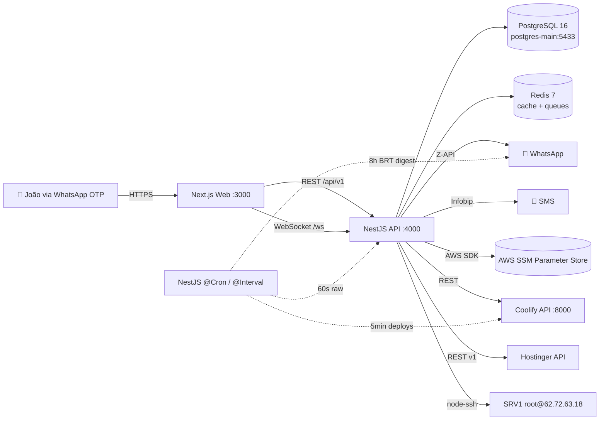

# Controler v4 — Architecture

## Visão geral

Controler v4 é um sistema NOC (Network Operations Center) construído como **monorepo**
em pnpm workspaces, composto de:

- **`apps/web`** — Next.js 14 (App Router, RSC desligado nas pages cliente)
- **`apps/api`** — NestJS 10 com Fastify adapter
- **`packages/shared`** — tipos + Zod schemas compartilhados
- **`packages/ui`** — design tokens
- **`mcps/hestia`** — placeholder para MCP server HestiaCP (v4.1)

## Diagrama



## Banco de dados (Prisma)

Models principais:
- **`User`** — usuário admin com OTP login
- **`OtpToken`** — tokens descartáveis para login/reveal
- **`Session`** — sessões ativas (JWT access + refresh hash)
- **`VaultAuditLog`** — registro de toda leitura SSM
- **`AuditLog`** — ações administrativas
- **`TimelineEvent`** — feed de eventos cronológico
- **`MetricSnapshot`** / **`HostMetricSnapshot`** — métricas time-series
- **`AlertRule`** / **`AlertLog`** — alertas + regras configuráveis
- **`DeployHistory`** — histórico de deploys por projeto (upsert idempotente por `deploymentUuid`)
- **`Project`** / **`ProjectApi`** / **`Site`** — inventário monitorado
- **`ScannerFinding`** — achados do Resource Scanner

Models FASE 3 (séries temporais / KPIs — ver seção "Monitoramento"):
- **`Container`** — registry, 1 linha por container (chave = nome estável, não container id)
- **`ContainerMetricPoint`** / **`ContainerStateEvent`** — raw por container + transições de estado
- **`HostDiskIoPoint`** / **`HostProcessSample`** / **`SystemdUnitEvent`** — iostat, top processos, units
- **`SslCheckHistory`** — histórico de probes TLS por domínio
- **`ContainerMetricRollup`** / **`HostMetricRollup`** / **`AvailabilityRollup`** — agregados horário/diário

## Auth (espelho do MyClinicSoft)

```
1. POST /api/v1/auth/request-code  { phone }
   → encontra User pelo phone (active && !blocked)
   → gera código 6 dígitos com crypto.randomInt
   → INSERT OtpToken (sha256 hash, TTL 10min)
   → sendOtpMessage via Z-API (purpose=login)
   → response: { firstName }
   → RATE LIMIT: 5 tentativas/IP em 15min

2. POST /api/v1/auth/verify-code   { phone, code }
   → SELECT OtpToken WHERE codeHash=sha256(code) AND !used AND expires_at>NOW
   → REVOKE sessões anteriores (single-session)
   → INSERT Session (JWT 15min + refresh 7d hash)
   → response: { accessToken, refreshToken, user, expiresAt }
   → mark OTP used=true (anti-replay)

3. JwtAuthGuard em todas as rotas /api/v1/*
   → Bearer token → verifica JWT → SELECT Session → checa status/expiry
   → updates last_activity → req.user = { id, name, role, sessionId }

4. OtpReauthGuard para ações sensíveis (NOVO no v4)
   → POST /auth/reauth/request → gera OTP purpose="reveal" (TTL 5min)
   → exige header X-Otp-Code em:
       - POST /vault/reveal
       - POST /coolify/apps/:uuid/deploy
       - POST /srv1/services/:unit/restart
       - POST /scanner/findings/:id/fix
       - POST /coolify/apps/:uuid/stop|start|restart
```

## Realtime (WebSocket)

Canal `/ws` (Socket.IO) — eventos broadcast:
- `host:metrics` (a cada 30s)
- `container:metrics` (a cada 30s)
- `timeline` (on event)
- `alert:fired` (on dispatch)
- `deploy:update` (on coolify webhook futuro)

## Caching (Redis)

| Endpoint | TTL |
|----------|-----|
| `srv1:host-metrics` | 30s |
| `srv1:containers` | 10s |
| `srv1:services` | 60s |
| `srv1:ports` | 60s |
| `srv1:top:*` | 30s |
| `coolify:apps` | 30s |
| `coolify:servers` | 60s |
| `hestia:sites` | 60s |
| `hestia:mail-stack` | 60s |
| `alert:cooldown:*` | 30min (por ruleKey) |

## Secrets — TODOS em AWS SSM

Nenhum secret em variável de ambiente em produção. Lookup encadeado:
1. `process.env.X` (override local dev)
2. SSM `/controler/x`
3. SSM `/myclinicsoft/x` (fallback compartilhado para algumas chaves)

Cache em memória de 60s por chave (com `SsmService.invalidate(name)`).

## Schedulers (NestJS @Cron / @Interval)

| Job | Periodicidade | Função |
|-----|---------------|--------|
| `host-metrics` | 60s (`NOC_RAW_INTERVAL_MS`) | snapshot host + PSI + disk IO + top processos (a cada 5 ciclos) + WS + alertas |
| `container-metrics` | 60s (`NOC_RAW_INTERVAL_MS`) | registry + metric points + state events + alertas (33 containers) |
| `systemd-units` | 5min | transições failed↔active das units |
| `sites-check` | 15min | HTTP ping nos sites |
| `apis-ping` | 30min | ping nas ProjectApi com healthUrl |
| `coolify-deploys-sync` | 5min | upsert deploys via API Coolify + alerta failed/unhealthy |
| `ssl-probe` | 6/6h (+2min pós-boot) | probe TLS de todos os domínios |
| `rollup-hourly` / `rollup-daily` | :05 de cada hora / 00:25 UTC | recompute raw → rollup |
| `daily-digest` | 0 8 * * * BRT | WhatsApp resumo |
| `cleanup` | 0 3 * * * BRT | purge com retenção por tabela |
| `purge` | 03:45 BRT | purge das séries FASE 3 em lotes |

## Monitoramento (FASE 3, 2026-07)

O controler **é** o NOC do SRV1 (não há Prometheus/Grafana/cAdvisor). Frameworks por camada:
**USE + PSI** no host, **docker stats** por container, **RED** em serviços/APIs, **Golden Signals**
no /overview. Catálogo completo de KPIs/limiares em `Fase1-Arquitetura-KPIs-2026-07-02.md`.

### Fontes de coleta

| Fonte | Via | O quê |
|-------|-----|-------|
| **SSH SRV1** | `root@62.72.63.18:47391` (chave montada `/root/.ssh/id_ed25519`, override `SRV1_SSH_KEY_PATH`) | PSI `/proc/pressure/*`, iostat, `/proc/net/dev`, docker stats/inspect (33 containers), systemd, top processos, portas |
| **Coolify API** | `http://10.0.6.1:8000` — `GET /api/v1/deployments/applications/{uuid}` | estado de apps + histórico de deploys (fonte de verdade, upsert por `deploymentUuid`) |
| **Hostinger API** | REST v1 (vm 1379597) | baseline cpu/ram/disk/tráfego/uptime na visão do hypervisor |
| **TLS probe** | `tls.connect(443, SNI)` direto do container (sem SSH) | `notAfter`/issuer/daysRemaining de todos os `Site` + noc.controler.net.br |

### Cadências e retenção

- **Raw 60s** (host + containers) — configurável via env `NOC_RAW_INTERVAL_MS`; guarda de
  sobreposição por tick + circuit breaker `load1m > 3×nproc` (dinâmico, KVM8 = 24).
- **Rollups horário/diário** SEMPRE recomputados do raw (nunca incremental — p95 não é composável);
  upsert idempotente pelos `@@unique`; catch-up no boot (48h horário / 7d diário).
- **Retenção** (purge diário): raw containers/iostat 10d · snapshots host 30d · top processos 7d ·
  state/systemd events 180d · rollup horário 90d · diário 400d.

### Endpoints novos

- `/api/v1/srv1/saturation` · `/srv1/diskio` · `/srv1/network` · `/srv1/containers/:name/events`
- `/api/v1/analytics/health` (Health Score composto) · `/analytics/reliability` (disponibilidade %, MTTR/MTBF, deploy success rate)

### Contrato com o frontend

Todas as respostas consumidas pelo web são validadas com **Zod** em `apps/web/lib/schemas.ts`
(contrato compartilhado — se o backend mudar shape, o front acusa em runtime, não renderiza lixo).
Dados mock remanescentes são **rotulados** na UI até o coletor correspondente estar ligado.

### Migrations

- `prisma migrate deploy` roda **no start do container da API** (CMD do `apps/api/Dockerfile`) —
  idempotente; baseline `0_baseline` resolvido em prod em 2026-07-02.
- **`db push` é PROIBIDO em produção** (ver `apps/api/prisma/migrations/README.md`).

## Deploy

Container único `controler-v4` no Coolify, composto via `docker-compose.yml`:
- `postgres` (porta 5432 interna) — *ou* aponta para `postgres-main:5433` host
- `redis` (porta 6379 interna)
- `api` (porta 4000) — health `/health`
- `web` (porta 3000) — health `/api/healthz`

Traefik faz roteamento por subdomínio:
- `controler-v4.net.br` → web:3000
- `api.controler-v4.net.br` → api:4000  *(opcional; web faz proxy via rewrite)*

## Diferenças vs Controler v3

| Aspecto | v3 (Python+Preact) | v4 (NestJS+Next.js) |
|---------|-------------------|---------------------|
| Stack | FastAPI + esm.sh CDN | NestJS + Next 14 build |
| DB | SQLite local | Postgres 16 |
| Auth | Basic Auth | OTP WhatsApp + JWT + re-auth |
| Realtime | Polling 5-30s | WebSocket Socket.IO |
| Cache | nenhum | Redis com TTL por endpoint |
| Reveal vault | toggle simples | OTP + audit log |
| Telas | 9 | 10 (8 + drills de container e Coolify) + login |
| KPIs | 18 | 66+ |
| Testes | nenhum | Vitest + Playwright (placeholder) |
| Type safety | sem | TS strict em tudo |
