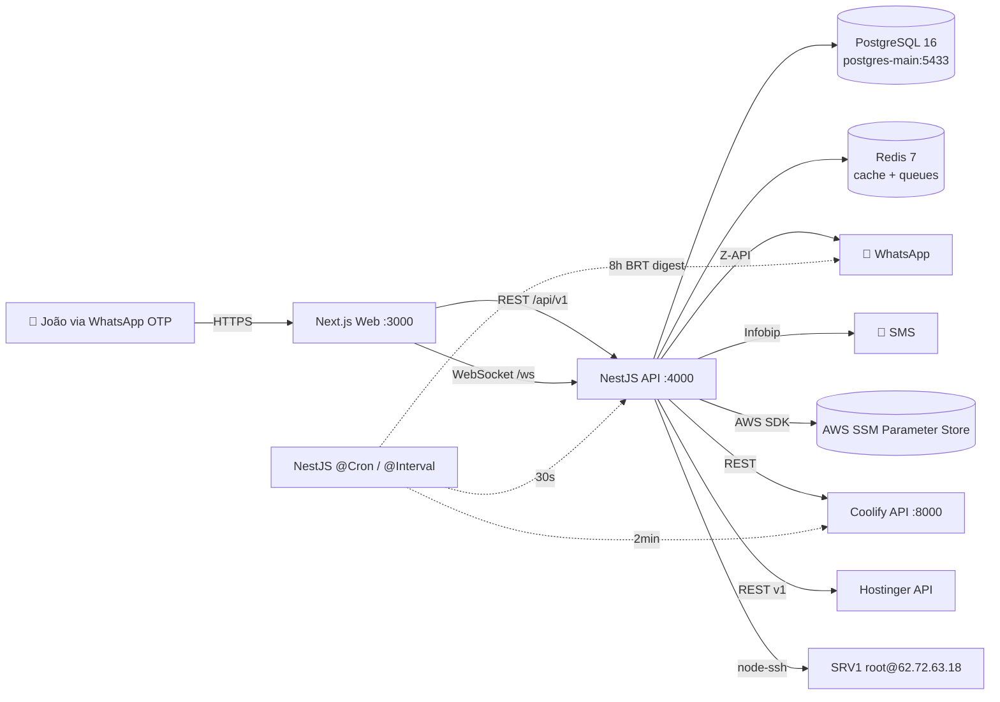

# Controler v4 — Architecture

## Visão geral

Controler v4 é um sistema NOC (Network Operations Center) construído como **monorepo**
em pnpm workspaces, composto de:

- **`apps/web`** — Next.js 14 (App Router, RSC desligado nas pages cliente)
- **`apps/api`** — NestJS 10 com Fastify adapter
- **`packages/shared`** — tipos + Zod schemas compartilhados
- **`packages/ui`** — design tokens
- **`mcps/hestia`** — placeholder para MCP server HestiaCP (v4.1)

## Diagrama



## Banco de dados (Prisma)

Models principais:
- **`User`** — usuário admin com OTP login
- **`OtpToken`** — tokens descartáveis para login/reveal
- **`Session`** — sessões ativas (JWT access + refresh hash)
- **`VaultAuditLog`** — registro de toda leitura SSM
- **`AuditLog`** — ações administrativas
- **`TimelineEvent`** — feed de eventos cronológico
- **`MetricSnapshot`** / **`HostMetricSnapshot`** — métricas time-series
- **`AlertRule`** / **`AlertLog`** — alertas + regras configuráveis
- **`DeployHistory`** — histórico de deploys por projeto
- **`Project`** / **`ProjectApi`** / **`Site`** — inventário monitorado
- **`ScannerFinding`** — achados do Resource Scanner

## Auth (espelho do MyClinicSoft)

```
1. POST /api/v1/auth/request-code  { phone }
   → encontra User pelo phone (active && !blocked)
   → gera código 6 dígitos com crypto.randomInt
   → INSERT OtpToken (sha256 hash, TTL 10min)
   → sendOtpMessage via Z-API (purpose=login)
   → response: { firstName }
   → RATE LIMIT: 5 tentativas/IP em 15min

2. POST /api/v1/auth/verify-code   { phone, code }
   → SELECT OtpToken WHERE codeHash=sha256(code) AND !used AND expires_at>NOW
   → REVOKE sessões anteriores (single-session)
   → INSERT Session (JWT 15min + refresh 7d hash)
   → response: { accessToken, refreshToken, user, expiresAt }
   → mark OTP used=true (anti-replay)

3. JwtAuthGuard em todas as rotas /api/v1/*
   → Bearer token → verifica JWT → SELECT Session → checa status/expiry
   → updates last_activity → req.user = { id, name, role, sessionId }

4. OtpReauthGuard para ações sensíveis (NOVO no v4)
   → POST /auth/reauth/request → gera OTP purpose="reveal" (TTL 5min)
   → exige header X-Otp-Code em:
       - POST /vault/reveal
       - POST /coolify/apps/:uuid/deploy
       - POST /srv1/services/:unit/restart
       - POST /scanner/findings/:id/fix
       - POST /coolify/apps/:uuid/stop|start|restart
```

## Realtime (WebSocket)

Canal `/ws` (Socket.IO) — eventos broadcast:
- `host:metrics` (a cada 30s)
- `container:metrics` (a cada 30s)
- `timeline` (on event)
- `alert:fired` (on dispatch)
- `deploy:update` (on coolify webhook futuro)

## Caching (Redis)

| Endpoint | TTL |
|----------|-----|
| `srv1:host-metrics` | 30s |
| `srv1:containers` | 10s |
| `srv1:services` | 60s |
| `srv1:ports` | 60s |
| `srv1:top:*` | 30s |
| `coolify:apps` | 30s |
| `coolify:servers` | 60s |
| `hestia:sites` | 60s |
| `hestia:mail-stack` | 60s |
| `alert:cooldown:*` | 30min (por ruleKey) |

## Secrets — TODOS em AWS SSM

Nenhum secret em variável de ambiente em produção. Lookup encadeado:
1. `process.env.X` (override local dev)
2. SSM `/controler/x`
3. SSM `/myclinicsoft/x` (fallback compartilhado para algumas chaves)

Cache em memória de 60s por chave (com `SsmService.invalidate(name)`).

## Schedulers (NestJS @Cron / @Interval)

| Job | Periodicidade | Função |
|-----|---------------|--------|
| `host-metrics` | 30s | snapshot + emit WS |
| `container-metrics` | 30s | snapshot + emit WS |
| `daily-digest` | 0 8 * * * BRT | WhatsApp resumo |
| `cleanup` | 0 3 * * * BRT | remove snapshots > 30d |

## Deploy

Container único `controler-v4` no Coolify, composto via `docker-compose.yml`:
- `postgres` (porta 5432 interna) — *ou* aponta para `postgres-main:5433` host
- `redis` (porta 6379 interna)
- `api` (porta 4000) — health `/health`
- `web` (porta 3000) — health `/api/healthz`

Traefik faz roteamento por subdomínio:
- `controler-v4.net.br` → web:3000
- `api.controler-v4.net.br` → api:4000  *(opcional; web faz proxy via rewrite)*

## Diferenças vs Controler v3

| Aspecto | v3 (Python+Preact) | v4 (NestJS+Next.js) |
|---------|-------------------|---------------------|
| Stack | FastAPI + esm.sh CDN | NestJS + Next 14 build |
| DB | SQLite local | Postgres 16 |
| Auth | Basic Auth | OTP WhatsApp + JWT + re-auth |
| Realtime | Polling 5-30s | WebSocket Socket.IO |
| Cache | nenhum | Redis com TTL por endpoint |
| Reveal vault | toggle simples | OTP + audit log |
| Telas | 9 | 8 (re-escopadas) + login |
| KPIs | 18 | 66+ |
| Testes | nenhum | Vitest + Playwright (placeholder) |
| Type safety | sem | TS strict em tudo |
