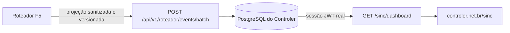

# Painel Sinc — contrato de entrega

## Objetivo

Expor em `controler.net.br/sinc` uma visão autenticada e somente leitura da ponte entre
Codex, Claude Code e Cowork. O painel informa o estado real da integração, os quatro projetos
acompanhados (`myclinicsoft`, `t4net-so`, `senhas-fisiomt` e `roteador`), versões compartilhadas,
contratos, rotas sanitizadas e a manutenção do mapa/Obsidian.

O Controler não executa agentes e não recebe conversa completa, prompt, raciocínio, código,
comando, segredo, dado pessoal, caminho local ou acesso ao SQLite do Roteador.

## Contrato registrado no Sinc

- Sessão: `88abf5d9-e585-42ad-af58-dd0336650638`
- Tarefa: `667d0b3f-575d-4bea-935b-65adc4a7919e`
- Contrato: `5feee1ff-bfc1-4f42-9709-b08a786d9779`
- Manifesto de contexto: `sha256:38df3856e75cd3979b54e25856c4dbfdbea4ef789c85f390b08c13feb9f9e74e`
- Hash do contrato: `sha256:5618b70725c6cd5878a834191613c7e3e6044ba3ce44199f08abd2af706244e2`
- Cobertura inicial: `sha256:5ab098b19317569f2d72ee2b8185a673b676792ff73c34597b97666552c742e5`

## Requisitos verificáveis

| ID | Entrega |
|---|---|
| REQ-401 | Controler não acessa SQLite nem recebe conteúdo proibido. |
| REQ-402 | Ingestão aceita somente projeção F5 versionada e usa credencial exclusiva do SSM. |
| REQ-403 | Leitura exige sessão real do Controler e não concede autoridade de execução. |
| REQ-404 | Painel mostra ponte, projetos, clientes, versões, contratos, rotas, mapa e Obsidian sem inventar estado. |
| REQ-405 | Typecheck, testes, verificação visual em 1280/1920, commit, deploy, health e paridade comprovados. |

## Fronteira da integração

Contrato F5 consumido: `188d5d3f7d606d950ccb262f7fb0212f91f85412`, publicado em
`roteador/origin/main` após auditoria Astra Medium.

A credencial de ingestão vive no SSM em `/controler/sinc_ingest_token`. O cliente envia um lote
`route-events-batch-v1` de um único projeto, com 1–100 eventos e no máximo 64 KiB, por HTTPS.
O Controler valida UUIDs, hashes SHA-256, hash canônico integral, versão, formato fechado e
campos proibidos antes de persistir. Reenvio idêntico é idempotente; colisão com conteúdo
diferente rejeita o lote inteiro. Estado ausente ou não medido aparece dessa forma no painel.

## Versões de referência

| Componente | Versão inicial |
|---|---|
| Sinc MCP | 2.1.0 |
| mac-dark | 2.6.3 |
| mac-light | 1.1.0 |

Esta tabela registra a referência inicial. O painel deve mostrar a versão recebida e a
compatibilidade medida; não deve promover automaticamente uma cópia antiga.

## Validação antes da publicação

- Compatibilidade cruzada: os 5 eventos da fixture F4 atravessaram
  `createRouteEventBatch` do Roteador e `parseSincBatch` do Controler com hash idêntico.
- API: 30 testes, incluindo PostgreSQL temporário e HTTP real dos guards.
- Roteador F5: 204 testes integrados, 17 testes focados e 42 probes adversariais.
- Web: typecheck e build de produção; estados de carregamento, vazio, erro e sucesso.
- Visual: 1280×900 e 1920×1080, sem overflow; 160 nós de texto com contraste mínimo 4,5285:1.
- Banco: backup pré-migration em produção, identificado por SHA-256 e mantido fora do repositório.
